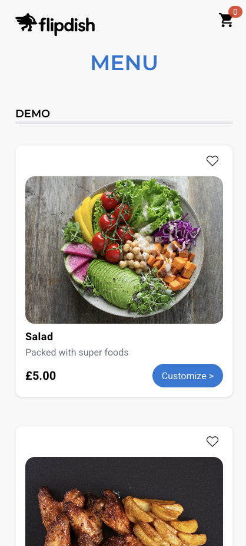
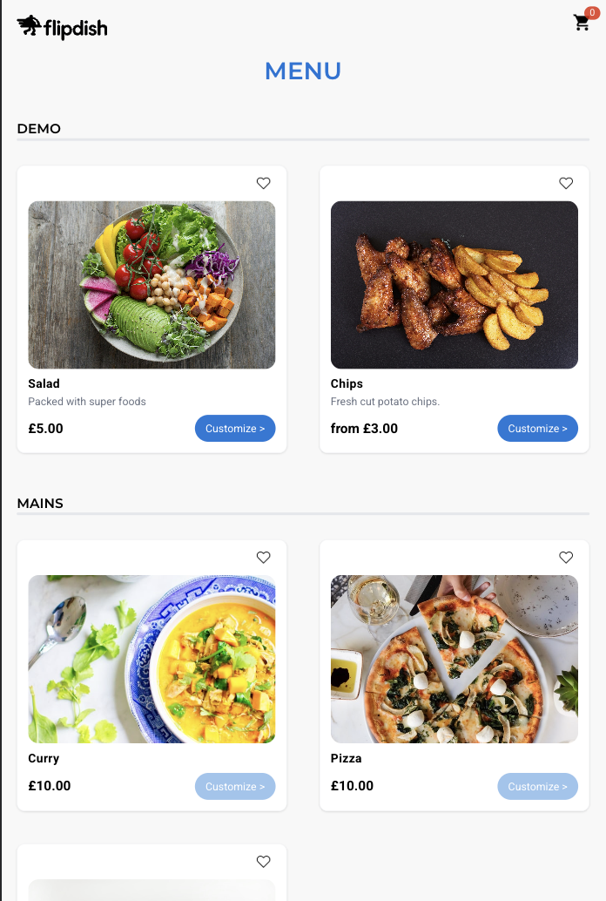

## 🍔 Flipdish Menu

This is a simple menu built with JavaScript, React, and tested with Jest and Playwright.

<div>
    
      &nbsp;&nbsp;&nbsp;
    

</div>

---

## 🚀 Features

- restaurant menu fetched from the external JSON
- consists of sections, items, options, and a price calculation that depends on the master condition
- if the master condition is true, the price is ignored in the items and the minimum price is displayed; if false, the items' price is displayed

---

## 🧱 Tech Stack

- React 19
- JavaScript
- Vite
- Jest
- Playwright
- Fully reponsive design

---

## ⚙️ Getting Started

_Clone the repo
_

```bash
git clone https://github.com/LikaNur/flipdish-menu.git
```

```bash
cd flipdish-menu
```

_Install dependencies
_

```bash
npm install
```

_Run the development server
_

```bash
npm run dev
```
